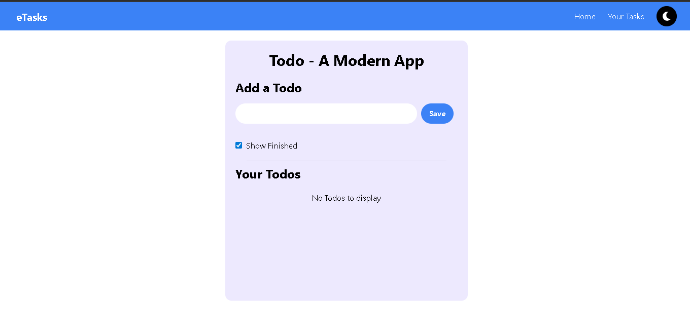

# 📝 eTasks – A Modern Todo App

A sleek, fully responsive Todo app built using **React**, **Tailwind CSS**, and **localStorage**, featuring dark mode toggle, task validation, and delete confirmation.

## 🔗 Live Demo

👉 [View Live on Vercel](https://etasks-app.vercel.app/)

---

## ✨ Features

- ✅ Add, edit, delete todos
- ❌ Delete confirmation before removing tasks
- 🔄 Toggle between **light and dark mode**
- 📦 Stores your todos in **localStorage**
- 🚫 Prevents adding duplicate tasks
- 🎯 Filter to show/hide completed todos
- ⚡ Fully responsive UI with **Tailwind CSS**
- 🎨 Visually appealing and minimalist design

---

## 📸 Screenshots


---

## 🚀 Getting Started

Clone the repo and install dependencies:

```bash
git clone https://github.com/SumitDesai-21/To-do-list.git
cd To-do-list
npm install
npm run dev
```
---

## 🛠️ Built With

- [React](https://reactjs.org/) – Front-end JavaScript library for building user interfaces
- [Tailwind CSS](https://tailwindcss.com/) – Utility-first CSS framework for styling
- [Vercel](https://vercel.com/) – Hosting and deployment platform
- [uuid](https://www.npmjs.com/package/uuid) – For generating unique task IDs
- [React Icons](https://react-icons.github.io/react-icons/) – For adding modern icons

---

## 📁 Folder Structure

```
to-do-list/
├── public/
├── src/
│   ├── components/
│   │   └── Navbar.jsx
│   ├── App.jsx
│   ├── index.js
│   └── ...
├── tailwind.config.js
├── package.json
└── README.md
```

---

## 🤝 Author

**Sumit Desai**  
📫 [GitHub Profile](https://github.com/SumitDesai-21)

---

## 📜 License

This project is open source and free to use under the [MIT License](https://opensource.org/licenses/MIT).

---

## ⭐️ Show Your Support

If you like this project, feel free to:

- ⭐ Star the repository
- 🍴 Fork it
- 🧑‍💻 Share it with others
